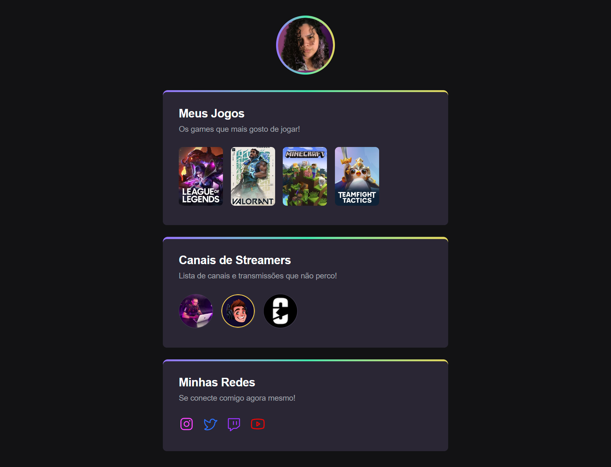

<h1 align="center"> NLW eSports</h1>

Estudo sobre componentes em React, fazendo a refatoração do projeto realizado na NLW eSports na trilha explorer!

  <a href="#-tecnologias">Tecnologias</a>&nbsp;&nbsp;&nbsp;|&nbsp;&nbsp;&nbsp;
  <a href="#memo-licença">Licença</a>

  

 

  

## 🚀 Tecnologias

Esse projeto foi desenvolvido com as seguintes tecnologias:

- [React](https://pt-br.reactjs.org/)

## :memo: Licença

Esse projeto está sob a licença MIT.

---

Feito com ♥ por mim junto com a Rocketseat :wave: 

